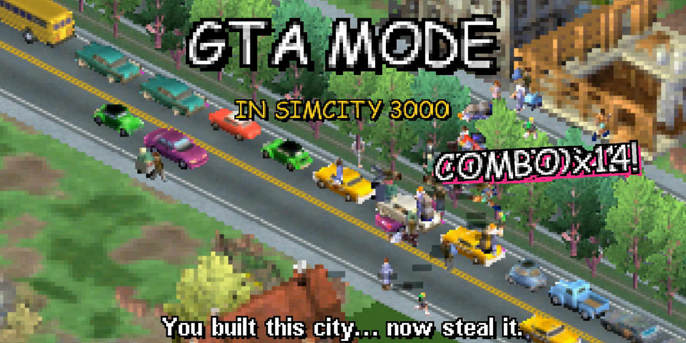

# GTA Mode for SimCity 3000 Unlimited

[](docs/trailer.mp4)

Walk around any SimCity 3000 city as one of its citizens. Punch people, steal cars, drive the city's real
streets and get busted by the police. GTA Mode is a native plugin for the original 1999 game (SimCity 3000
Unlimited): no remaster, no patched EXE, and none of the game's files are changed.

**[Download](https://github.com/DenisSergeevitch/simcity3000-gta-mode/releases/latest)** ·
**[Trailer with sound](docs/trailer.mp4)**

## Features

- **Possess any citizen.** Tab cycles through the people around you, Enter takes control.
- **Walk, run and fight.** WASD walks, Shift runs, Space punches. Most people run away. Some fight back with
  real punches and kicks from the game's own animations.
- **Steal any car**, parked or moving (the driver gets thrown out), and drive it anywhere. Traffic follows the
  city's real road network and stops for you.
- **Run people over** and they fly. Hits in a row count up a combo.
- **Wanted stars and police.** Cops come after you on foot. They can knock you down: WASTED, or BUSTED.
- **The city is in the way.** Buildings, trees and highways hide you and your car like everything else in the
  city, and an outline shows where you are when something covers you. You can't walk or drive through them.
- **Every city works.** The map, roads and buildings are read from the running game, so built-in cities and
  your own saves both work.
- **The game's own art.** Characters and cars are drawn with the sprites in your install. The mod ships no game
  assets.

## Install

You need your own copy of SimCity 3000 Unlimited (the Steam release was used for development).

### Windows

1. Download `gta-mode-1.0.0.zip` from [Releases](https://github.com/DenisSergeevitch/simcity3000-gta-mode/releases)
   and copy `gta_mode.dll` into the game's `Apps` folder, the one that contains `SC3U.exe`.
2. Install [cnc-ddraw](https://github.com/FunkyFr3sh/cnc-ddraw/releases) into the same folder and set
   `renderer=opengl` in its `ddraw.ini`. The HUD, markers and outlines are drawn through cnc-ddraw's OpenGL
   renderer. Without it the mode still runs, but you won't see the HUD.
3. Start the game, load any city and press **G**.

To uninstall, delete `gta_mode.dll`. The mod never changes saves or game files. It writes only `gta_mode.log`
in the `Apps` folder.

### macOS and Linux (Wine)

The game runs well under Wine with cnc-ddraw. Development happened on an Apple Silicon Mac with Homebrew's Wine 11.
[docs/macos-wine.md](docs/macos-wine.md) walks through the setup. Then copy `gta_mode.dll` into `Apps` as above.

## Controls

Load any city, then press **G**.

| Key | On foot | In a car |
|---|---|---|
| G | start / quit GTA mode | quit GTA mode |
| Tab | (while choosing) next citizen | |
| Enter | (while choosing) take control; get into the nearest car | get out |
| W A S D / arrows | walk, relative to the screen | accelerate, brake / reverse, steer |
| Shift | run | |
| Space | punch | handbrake |

GTA mode zooms all the way in and puts citizens on the sidewalks around you. One of them blinks: that's who
you'll become. Three hits knock someone out. With a wanted star or more, the police come for you. Stars fade if
you lie low.

## How it works

- **A plugin the game loads by itself.** SC3U.exe loads every DLL in its `Apps` folder through Maxis's GZCOM
  framework (the ancestor of SimCity 4's). `gta_mode.dll` returns a GZCOM director, and the director registers a
  tick service, so the mod runs once per frame on the game's own thread.
- **People and cars are real game sprites.** They are added to the game's own dynamic sprite system in
  SIMSPR.DLL, the same one that draws road traffic, trees and pylons. The game sorts them with its buildings, so
  whatever stands in front of them hides them.
- **The city comes from memory.** The camera and projection are SIMSPR's view object and math. Roads come from
  SIMNTWRK's network pieces and buildings and trees from SIMGEOM's occupants, found by scanning the heap for
  their class vtables.
- **Art from your install.** Sprites are decoded at runtime from `People.DAT` and `Vehicles.DAT` (an IXF index of
  RefPack-compressed, run-length RGB565 images).
- **The HUD** is composited at the moment cnc-ddraw uploads each frame to OpenGL, by swapping its
  `glTexSubImage2D` function pointer. The game's own surfaces are never touched.

All 30 of the game's binaries were reverse-engineered with Ghidra to find these. [MODLOG.md](MODLOG.md) is the
journal: addresses, data formats, dead ends.

## Known issues

- The city's own traffic and pedestrians can't be stolen or punched yet. The mod spawns its own look-alikes
  around you instead.
- People flying through the air after a car hit, and knocked-out people without a fall animation, are drawn on
  top of buildings.
- Water doesn't block you.
- The mod supports the game DLLs that ship with the Steam release (the April 2000 builds of SIMSPR, SIMNTWRK and
  SIMGEOM). On any other build it switches itself off and says why in `gta_mode.log`.
- During development, long drives in Madrid occasionally crashed the game, which also happened once with GTA mode
  off. If it crashes for you, please open an issue with your `gta_mode.log`.
- Developed and tested under Wine on macOS. Windows reports are very welcome.

## Building from source

You need a 32-bit mingw-w64 compiler: `brew install mingw-w64` on macOS, `sudo apt install gcc-mingw-w64-i686`
on Debian/Ubuntu, or `pacman -S mingw-w64-i686-gcc` in MSYS2 on Windows.

```bash
./build.sh                    # build/gta_mode.dll
SC3U_APPS="/path/to/SimCity 3000 Unlimited/Apps" ./build.sh   # and copy it into the game
./build.sh --dist             # also dist/gta-mode-<version>.zip
```

Stop the game before installing a new build. Replacing a loaded DLL can crash it under Wine.

## For modders

- **Developer command channel.** Create an empty `gta_mode.dev` file in `Apps` before starting the game. The mod
  then reads commands from `Apps\gta_cmd.txt` and answers in `gta_out.txt`: memory reads and writes, function
  calls, an in-process memory scanner, synthetic input, frame grabs and recording, and the filming commands
  used for the trailer. The channel is off without that file. The `tools/` scripts (zsh, written for macOS and
  Wine) drive it; set `SC3U_APPS` to the game's `Apps` folder first. `tools/start_city.sh "Berlin, Germany" --play`
  restarts the game into a city, and `tools/gtacmd.sh "gta on" "gta possess"` sends commands.
- **File formats.** `tools/sc3spr.py` reads the sprite archives and `tools/fbf.py` renders text in the game's
  bitmap fonts (`Res/Text/*.FBF`). The formats are written up in MODLOG.md.
- **The trailer** was recorded in game with the mod's frame recorder and edited with HyperFrames. Its music and
  sound effects are the game's own, and all its text uses the game's fonts. The edit's sources aren't in this
  repo, because they contain the game's graphics and audio.

## Credits

Made by [@DenisSergeevitch](https://github.com/DenisSergeevitch) with [Claude Code](https://claude.com/claude-code),
which did the reverse engineering, wrote the mod and cut the trailer. cnc-ddraw is by FunkyFr3sh.

SimCity 3000 Unlimited is © Electronic Arts / Maxis. This is an unofficial fan project, not affiliated with or
endorsed by Electronic Arts, Maxis, Rockstar Games or Take-Two. "GTA" only describes the style of play. You need
your own copy of the game; this repository and its releases contain none of the game's files.

## License

[MIT](LICENSE)
